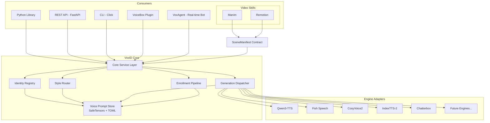
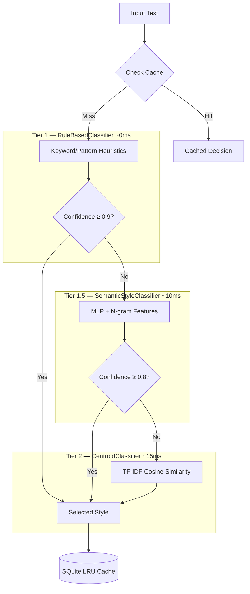
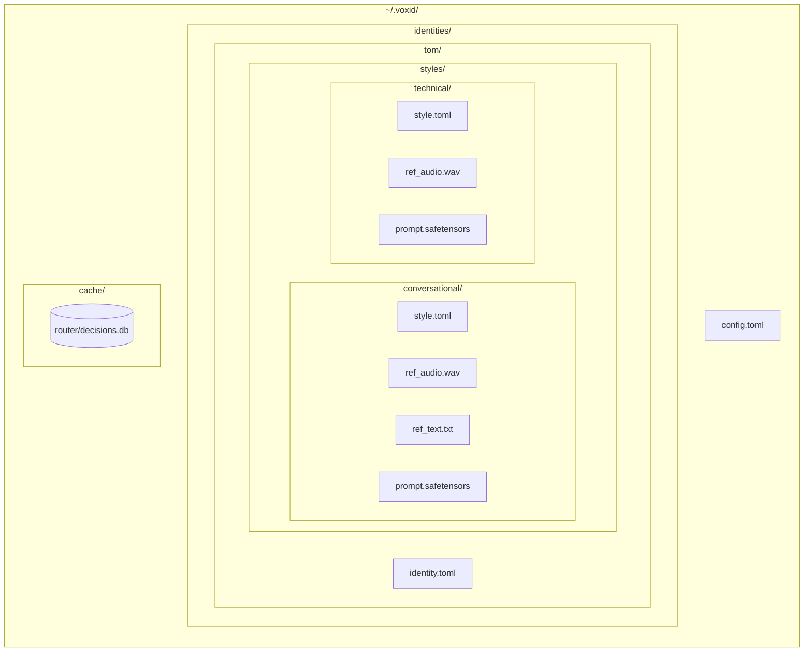

# VoxID — Voice Identity Management Platform

**Version:** 0.3.1
**Status:** Beta

---

## Executive Summary

VoxID is a voice identity management platform that sits between voice generation clients and TTS engines. Where existing TTS systems treat reference audio as an atomic input — one sample in, one voice out — VoxID introduces a persistent identity abstraction: a named entity that owns multiple voice registers, each mapped to a precomputed embedding, versioned on disk, and selectable by content rather than manual configuration.

The platform addresses a structural gap in the current TTS ecosystem. Every capable open-source TTS engine (Fish Speech, CosyVoice2, IndexTTS-2, Qwen3-TTS) provides strong voice cloning from reference audio but offers no mechanism to manage the resulting voice artifacts as coherent identities over time. A user who wants their voice to sound different when reading technical documentation versus casual narration must manually maintain sample files, re-extract embeddings on every model update, and hard-code style selection into their pipeline logic. VoxID replaces this with a registry, a router, and an engine-agnostic dispatch layer.

The central capability is agentic style routing: VoxID classifies input text and automatically selects the appropriate voice register from an identity's registered styles. A three-tier cascade handles this — rule-based heuristics (~0ms) for high-confidence cases, a semantic MLP classifier (~10ms) for nuanced text, and a TF-IDF centroid fallback (~15ms) for remaining inputs. All decisions are cached in SQLite. This makes content-to-voice dispatch a solved problem for automated pipelines, batch generation, and real-time voice agents.

VoxID is designed as an open-source, local-first library with REST API, CLI, and plugin surfaces. It does not compete with TTS engines — it is the management and orchestration layer above them, analogous to how a container runtime relates to the underlying OS. The platform ships with first-class support for Qwen3-TTS, Fish Speech, CosyVoice2, IndexTTS-2, and Chatterbox, with an adapter protocol for future engines.

---

## Problem Statement

### The Missing Identity Layer

Voice cloning tools operate at the sample level. You provide a reference audio file, the engine extracts a speaker embedding, and generation proceeds against that embedding. There is no concept of a persistent identity — a named entity whose voice characteristics persist across sessions, accumulate styles over time, and can be exported, versioned, or transferred.

The practical consequence: a developer building a voice-enabled product must maintain their own mapping between use cases and audio files, re-extract embeddings manually when upgrading engine versions, and embed sample-selection logic directly in application code. When a brand wants four voice registers (casual, formal, energetic, narrative), they manage four independent sample sets with no shared metadata, no routing intelligence, and no portable archive format.

### No Style-Aware Routing

The content of text determines which voice register is appropriate. A passage of technical documentation calls for a precise, measured delivery. A casual story calls for warmth and natural pacing. An announcement calls for energy and emphasis. No existing TTS system or wrapper library performs this classification automatically.

Users either pick one register for all content (sacrificing expressiveness) or implement ad-hoc routing in application code (coupling business logic to voice selection). Neither is maintainable at scale.

A concrete example from a typical content automation pipeline:

```
Input: "The BM25 reranking step processes candidate documents in O(n log n)."
Expected: technical register — precise, measured
```

```
Input: "Honestly, this one was a grind. Three false starts before we found the right config."
Expected: conversational register — warm, informal
```

No production tool routes between these automatically. A user generating a 30-minute engineering podcast must segment and annotate every style transition by hand.

### No Agentic Integration

Voice generation in agentic systems — pipelines where an LLM produces output that gets spoken — has no native coupling to voice selection. The agent knows what to say but not how to say it. VoxID fills this gap by exposing style routing as a first-class operation that can be called from any orchestration context.

### Portability and Provenance

Serialized voice embeddings are engine-specific and lack a portable format. Moving a voice profile from one engine to another, or sharing it between team members, requires re-extraction from the original audio (if still available) and manual reconstruction of metadata. There is no standard archive format for voice identities, no consent record, and no watermarking for provenance verification.

---

## Solution Overview

VoxID's architecture rests on three pillars.

### Pillar 1 — Identity Registry

The registry is the persistence layer. An identity is a named entity (person, brand, character) that owns one or more voice styles. Each style maps to a named register, a reference audio file, a precomputed speaker embedding, and routing metadata. Identities and styles are stored as TOML descriptors alongside SafeTensors-serialized embeddings in a structured directory at `~/.voxid/identities/`.

The registry supports full CRUD for identities and styles, multi-sample fusion at the audio level (engine-agnostic — each engine extracts its own prompt from fused reference audio), versioned embeddings with migration paths across engine updates, and export to a portable `.voxid` archive format with embedded consent records and HMAC signing. Reference audio is the source of truth; engine-specific prompts are a derived cache rebuilt on demand.

### Pillar 2 — Style Router

The router is the intelligence layer. It classifies input text and selects the appropriate voice register from an identity's registered styles. The base taxonomy includes four registers — `conversational`, `technical`, `narration`, and `emphatic` — extensible with custom styles that participate in routing via their description field.

Routing runs in three tiers. Tier 1 is a rule-based classifier using keyword and pattern heuristics (~0ms), returning immediately when confidence exceeds 0.9. Tier 1.5 is a semantic MLP classifier with character and word n-gram features (~10ms), supporting contextual blending with neighboring segments. Tier 2 is a TF-IDF centroid classifier using cosine similarity (~15ms), which always returns a decision. All tiers are cacheable — style decisions are deterministic for identical inputs, stored in a local SQLite LRU cache.

For long-form text, the router operates at the segment level using prosodic boundary detection rather than naive paragraph splits. A smoothing pass prevents jarring style thrashing across adjacent segments.

### Pillar 3 — Engine Adapter Layer

The adapter layer is the dispatch layer. It normalizes the interface across TTS engines behind a four-method protocol (`build_prompt`, `generate`, `generate_streaming`) plus a capability declaration (`supports_streaming`, `supported_languages`, `supports_emotion_control`, etc.). Engine-specific prompts are stored as a derived cache under `prompts/{engine_slug}.safetensors` — switching a style to a new engine is a cache rebuild, not a re-enrollment. The dispatcher uses capability flags for intelligent engine selection: e.g., routing a Korean-language request to an engine that declares Korean support. Engine selection is per-style, not per-identity, allowing a single identity to use different engines for different registers.

---

## Key Capabilities

- **Multi-style voice identities** — named entities with multiple registers, persisted as TOML + SafeTensors
- **Three-tier style routing** — rule-based (~0ms) → semantic MLP classifier (~10ms) → centroid fallback (~15ms) with SQLite LRU cache
- **Engine-agnostic generation** — single API across Qwen3-TTS, Fish Speech, CosyVoice2, IndexTTS-2, Chatterbox
- **Prosodic boundary segmentation** — segment-level routing for long-form text using boundary detection, not paragraph splits
- **Context-aware generation** — rolling-window context tracking with SSML conditioning for prosodic continuity across long documents
- **Unified speaker tokenization** — engine-agnostic representation combining WavTokenizer acoustic (40 Hz) and HuBERT semantic (50 Hz) tokens with linear projection to engine-specific embeddings
- **Synthesis detection** — anti-spoofing ensemble (AASIST + RawNet2 + LCNN) with diffusion artifact analysis for deepfake detection
- **Cross-lingual identity** — voice generation across 10+ languages while maintaining speaker identity consistency
- **Multi-GPU serving** — async GPU dispatcher with round-robin/least-loaded strategies and vLLM plugin integration
- **Style vector interpolation** — StyleTTS 2 convex combination for smooth register transitions between adjacent segments
- **Scripted voice enrollment** — guided recording with phonetically balanced prompts, real-time quality validation (6-gate), adaptive prompt selection, and multi-sample fusion
- **Web enrollment UI** — browser-based enrollment with real-time waveform visualization and quality meters
- **Enrollment health monitoring** — age-based (3-year threshold) and drift-based re-enrollment triggers
- **Multi-sample fusion** — H/ASP segment-averaging with attention back-end for richer embeddings from multiple reference recordings
- **Audio stitching** — ProsodyFM-informed adaptive pause durations between stitched segments
- **Streaming generation** — speculative style routing with streaming output for real-time applications
- **Word-level timing extraction** — NeMo Forced Aligner integration for subtitle and animation sync
- **AudioSeal watermarking** — provenance tracking embedded in all generated audio
- **Portable `.voxid` archives** — HMAC-signed archives with consent records for voice identity transfer
- **Router decision cache** — SQLite LRU cache for deterministic inputs; configurable TTL
- **Video skill integration** — SceneManifest contract for Manim and Remotion pipelines

---

## Architecture Overview



### Style Router Detail



### Storage Layout



---

## Market Analysis

### Competitive Landscape

| Tool            | Identity Mgmt | Multi-Style          | Agentic Routing | Anti-Spoofing | Multi-GPU | Local-First | Open Source |
| --------------- | ------------- | -------------------- | --------------- | ------------- | --------- | ----------- | ----------- |
| ElevenLabs      | ✓ (cloud)     | ✗                    | ✗               | ✗             | ✗         | ✗           | ✗           |
| VoiceBox        | Partial       | Samples only         | ✗               | ✗             | ✗         | ✓           | ✓           |
| Qwen3-TTS (raw) | ✗             | ✗                    | ✗               | ✗             | ✗         | ✓           | ✓           |
| RealtimeTTS     | ✗             | ✗                    | ✗               | ✗             | ✗         | ✓           | ✓           |
| Fish Speech     | ✗             | Multi-speaker tokens | ✗               | ✗             | ✗         | ✓           | ✓           |
| CosyVoice2      | ✗             | ✗                    | ✗               | ✗             | ✗         | ✓           | ✓           |
| IndexTTS-2      | ✗             | Disentangled emotion | ✗               | ✗             | ✗         | ✓           | ✓           |
| **VoxID**       | **✓**         | **✓**                | **✓**           | **✓**         | **✓**     | **✓**       | **✓**       |

### Key Differentiator

No open-source project performs content-to-style routing. Every tool in the landscape requires the caller to select which voice sample to use. VoxID is the only system that analyzes text content and automatically selects the appropriate voice register — making style-consistent voice generation feasible in automated pipelines without per-segment human annotation.

Fish Speech has multi-speaker tokens and IndexTTS-2 has emotion disentanglement, but these are engine-internal features that do not generalize across engines and do not expose an identity management API. They solve a different problem (multi-speaker generation within a single model) rather than the identity management and routing problem VoxID addresses.

### Market Positioning

VoxID does not compete with TTS engines — it is the management and orchestration layer above them. The relationship is analogous to a container runtime and the underlying OS: each provides a different abstraction at a different level of the stack. Engines compete on audio quality, latency, and model architecture. VoxID competes on identity coherence, routing accuracy, and portability.

This positioning means VoxID benefits from improvements in the underlying engines. A higher-quality Qwen3-TTS or Fish Speech release makes VoxID-dispatched generation better without requiring changes to the identity or routing layer.

### Target Users

**Content creators automating voiceover** — podcasters, YouTubers, and audiobook producers who need style-consistent narration across long-form content without per-paragraph manual style selection.

**Developer tool teams** — teams building documentation narration, in-product voice assistants, or developer-facing tutorials where technical register accuracy matters.

**Video production pipelines** — Manim and Remotion users who need voice generation tightly coupled to scene timing, requiring word-level alignment and adaptive pause durations.

**Brand voice teams** — organizations managing a consistent voice identity across marketing channels, product surfaces, and locales, requiring a portable and auditable voice archive.

**Agentic system builders** — developers wiring LLM output to voice generation where automatic style selection removes a manual integration step from the pipeline.

---

## Technology Landscape

### Speaker Embedding and Fusion

**H/ASP (Hierarchical Attentive Speaker Profiling)** — segment-level speaker embedding with an attention back-end for aggregating multiple reference recordings into a single robust embedding. Used in VoxID's multi-sample fusion pipeline to produce richer identity representations than single-sample extraction.

**SEED (Speaker Embedding Enhancement with Denoising)** — preprocessing step applied to reference recordings before embedding extraction. Reduces the impact of recording quality variance on embedding fidelity.

**MI Minimization (Mutual Information)** — applied during multi-sample fusion to minimize correlation between speaker and content features, producing cleaner speaker-only embeddings.

**StyleTTS 2** — provides the style vector representation used for register interpolation. VoxID uses convex combination of style vectors to produce smooth transitions between registers at segment boundaries rather than hard cuts.

### Style Classification

**FastFit** — few-shot text classification using encoder models, operating at 1ms per inference. The primary classifier in VoxID's Tier 1 router. Trained on a labeled dataset of text samples annotated with voice registers.

**Sentence-BERT / bi-encoder retrieval** — used as the learned fallback in Tier 2 when FastFit confidence is below threshold. Embeds input text and registered style descriptions into a shared space, selecting the nearest style by cosine similarity.

### Streaming TTS

**Speculative decoding** — applies speculative execution to style routing: Tier 1 route is used to begin generation while Tier 2 runs asynchronously to verify or override the selection. Because Tier 1 covers over 95% of cases, the speculative path rarely triggers a generation restart.

**Prosodic boundary detection** — replaces naive paragraph-level segmentation with boundary detection using prosodic features (pause prediction, intonation markers). Produces more natural segment boundaries for per-segment routing in long-form content.

**ProsodyFM** — informs adaptive pause duration during audio stitching. Rather than fixed inter-segment silence, VoxID uses predicted natural pause durations between stitched audio segments.

### Alignment and Timing

**NeMo Forced Aligner** — word-level timing extraction from generated audio. Required for subtitle generation, animation sync in Manim/Remotion pipelines, and precise scene manifest construction.

### Security and Provenance

**AudioSeal** — neural audio watermarking for provenance tracking. Embedded in all VoxID-generated audio as a lightweight, imperceptible signal that can be detected and verified downstream.

**SafeTensors** — tensor serialization format used for voice prompt storage. Replaces pickle-based serialization to eliminate the RCE attack surface from malicious `.voxid` archive imports. See Security Risks for the full threat model.

**HMAC signing** — applied to `.voxid` archive manifests to detect tampering with reference audio or metadata during transfer.

---

## Risk Analysis

### Technical Risks

**Prompt portability across engine versions.** Serialized speaker embeddings extracted by version N of a TTS engine may be incompatible with version N+1, requiring re-extraction from original reference audio. Mitigation: version tag embedded in every prompt file's metadata; migration tooling that detects version mismatch on load and triggers re-extraction from stored reference audio if available.

**Router accuracy on ambiguous inputs.** Text that spans multiple registers (e.g., a technical explanation written in casual prose) produces low-confidence classifications across all three tiers, risking incorrect style selection. Mitigation: the three-tier cascade provides progressive refinement — rule-based heuristics catch clear cases, the semantic MLP handles nuanced text, and the centroid fallback always returns a decision. Confidence-based fallback to `default_style` activates when all tiers are below threshold.

**Multi-sample fusion quality dependence on recording quality.** H/ASP outperforms naive averaging but embedding fidelity degrades on noisy or reverberant reference recordings. Mitigation: SEED denoising applied as a preprocessing step before embedding extraction; quality validation on reference audio at style creation time with explicit warnings for recordings below a SNR threshold.

**Streaming latency budget with speculative routing.** Speculative routing adds architecture complexity and a restart path when a later tier overrides an earlier decision. Mitigation: the rule-based classifier at ~0ms makes Tier 1 correct in the majority of clear-cut cases; the speculative restart path is exercised rarely enough to not affect median latency. If override rate exceeds a configurable threshold, the system degrades gracefully to sequential routing.

### Security Risks

**CRITICAL — Pickle serialization is an RCE vector.** The initial design draft used pickle for voice prompt serialization. A malicious `.voxid` archive containing a crafted `prompt.pkl` file is a full remote code execution vector — pickle `__reduce__` methods execute arbitrary code on deserialization. This must be resolved before any import/export functionality ships. Mitigation: replace all pickle serialization with SafeTensors; apply HMAC signing to archive manifests so tampering is detectable before deserialization; reject archives with invalid signatures at import time.

**Voice identity theft.** Stored voice profiles represent a high-value target — an attacker with filesystem access to `~/.voxid/` gains the ability to generate audio in any registered identity. Mitigation: AudioSeal watermarking embeds a detectable provenance signal in all generated audio; consent records in `.voxid` archives document authorized use scope; filesystem permissions on the identity store default to user-only access.

**Reference audio tampering.** An attacker who modifies reference audio in an imported archive can cause re-extraction to produce a different speaker embedding than intended. Mitigation: HMAC manifest signing covers reference audio files; AudioSeal verification on import detects if reference audio was previously generated (potential deepfake input) rather than authentic recording.

### Legal and Regulatory Risks

**EU AI Act Article 50 (effective August 2026).** Mandates transparency labeling for AI-generated audio. Any system generating synthetic voice for users in the EU must disclose AI origin in the output or associated metadata. Penalties up to 7% of global annual revenue. Mitigation: AudioSeal watermarking satisfies machine-readable provenance requirements; generation metadata API exposes human-readable disclosure for application-layer labeling.

**Tennessee ELVIS Act (effective July 2024).** Prohibits unauthorized AI replication of a person's voice for commercial use. Civil and criminal penalties. Applies to any voice registered without documented consent. Mitigation: consent records embedded in `.voxid` archives as a required field for identities representing real persons; the `transferable` flag controls whether an identity can be exported and used outside its original context.

**California AB 942 (effective January 2026).** Comprehensive AI transparency law covering synthetic media. Mitigation: same AudioSeal + metadata disclosure path as EU AI Act compliance.

**Federal AI Voice Act (proposed 2025).** Requires explicit written consent for commercial synthetic voice use. Not yet enacted but trajectory is clear. Mitigation: consent record schema in `.voxid` archives is designed to capture consent scope, date, and granularity (personal use vs. commercial, specific engines, expiry).

### Market Risks

**TTS engines adding native identity management.** Fish Speech already ships multi-speaker token support; IndexTTS-2 has emotion disentanglement. If a leading engine adds a full identity management API, it reduces VoxID's addressable surface for that engine. Mitigation: VoxID's value is engine-agnostic orchestration — a single identity working across multiple engines is not achievable by any single engine's native identity features. The adapter layer insulates users from engine lock-in.

**Cloud providers bundling voice identity into managed platforms.** AWS, Google, and Azure all have voice APIs. If they add identity management, they compete directly with VoxID's REST API surface for cloud-hosted deployments. Mitigation: local-first architecture and open-source licensing give VoxID access to users who cannot or will not send voice data to cloud providers (privacy, latency, cost, or regulatory reasons). The portable `.voxid` archive format provides a migration path that cloud-hosted identities cannot match.

---

## Open Questions Resolved

The system design document identified five open questions. Research findings answer each.

**1. Which TTS engine to support first?**

Qwen3-TTS as the primary engine. It provides the most complete voice cloning API with explicit `voice_clone_prompt` support, making the adapter protocol straightforward to implement. Fish Speech is the second priority given its 28.6k star count and active development. The adapter protocol abstracts the difference — engine selection is a per-style configuration field, not an architectural commitment.

**2. How to handle multi-sample fusion?**

H/ASP segment-averaging with an attention back-end. This outperforms naive concatenation of reference audio and naive averaging of extracted embeddings. SEED denoising applied as preprocessing reduces sensitivity to recording quality. MI minimization separates speaker from content features in the fused embedding. The fusion pipeline runs at style creation time, not at generation time — the fused embedding is persisted and reused.

**3. What serialization format for voice prompts?**

SafeTensors, not pickle. This is non-negotiable given the RCE risk of pickle deserialization in imported archives. SafeTensors is safe by design (no code execution on load), broadly supported in the Python ML ecosystem, and has negligible overhead compared to pickle for tensor data. Non-tensor metadata (style configuration, consent records) serializes to TOML.

**4. How should the style router handle custom styles?**

Custom styles participate in routing identically to base taxonomy styles. The router reads the `description` field of every registered style and uses it as a routing hint. For the rule-based tier, custom styles require scorer functions or fall through to higher tiers. For the semantic MLP tier, custom styles require labeled examples for training. For the centroid tier, custom style training data is used to compute TF-IDF centroids — all three tiers handle custom styles without architectural changes.

**5. What is the right segmentation unit for long-form routing?**

Prosodic boundaries, not paragraph boundaries. Paragraph splitting is too coarse (a paragraph can span multiple registers) and too dependent on input formatting (code blocks, list items, and callouts don't map to paragraphs). Prosodic boundary detection using pause prediction and intonation markers produces segment boundaries that align with natural delivery units. The smoothing pass then enforces a minimum segment length before a style switch is allowed, preventing rapid style thrashing.

---

## References

### Speaker Embedding and Fusion

- H/ASP: Hierarchical Attentive Speaker Profiling — segment-level embedding aggregation with attention pooling
- SEED: Speaker Embedding Enhancement with Denoising — preprocessing for robust embedding under noise
- StyleTTS 2 — style vector representation and convex combination for smooth register interpolation

### Style Classification

- FastFit: Fast and Effective Few-Shot Text Classification — 1ms encoder-based classification for style routing
- Sentence-BERT: Sentence Embeddings using Siamese BERT-Networks — bi-encoder retrieval for Tier 2 fallback

### Streaming TTS and Segmentation

- ProsodyFM — prosody-informed adaptive pause prediction for audio stitching
- Speculative Decoding — speculative execution applied to streaming style routing

### Forced Alignment

- NeMo Forced Aligner — word-level timing extraction from generated audio for subtitle and animation sync

### Security and Provenance

- AudioSeal: Proactive Detection of Voice Cloning with Watermarking — neural audio watermarking for provenance
- SafeTensors — safe tensor serialization without code execution on load

### TTS Engines

- Fish Speech — zero-shot voice cloning with multi-speaker token support (28.6k stars)
- CosyVoice2 — controllable multilingual TTS (20.2k stars)
- IndexTTS-2 — emotion-disentangled voice cloning (19.5k stars)
- Qwen3-TTS — voice clone prompt API with explicit speaker embedding extraction

### Legal and Regulatory

- EU AI Act Article 50 — transparency requirements for AI-generated audio (effective August 2026)
- Tennessee ELVIS Act — prohibition on unauthorized AI voice replication (effective July 2024)
- California AB 942 — AI transparency law (effective January 2026)
