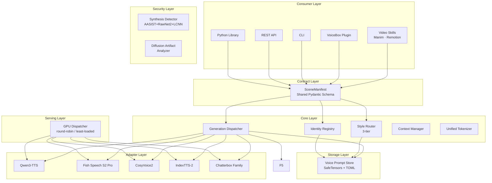
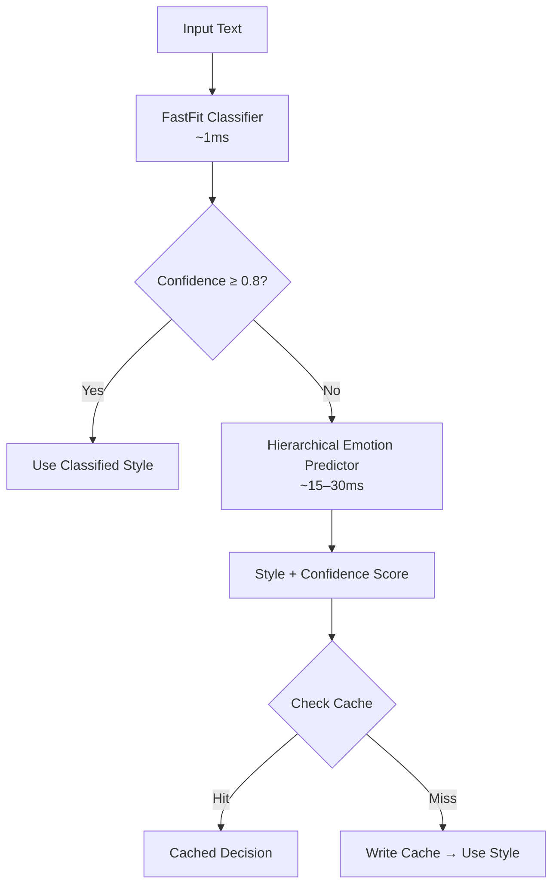
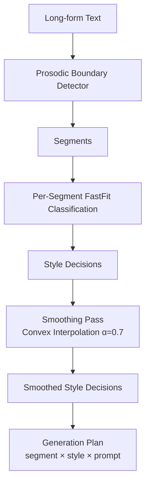
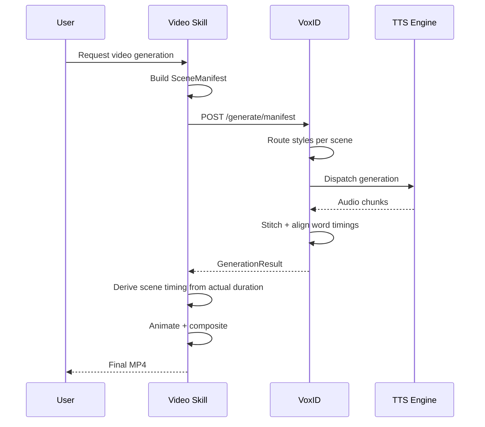
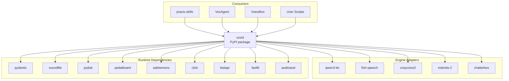
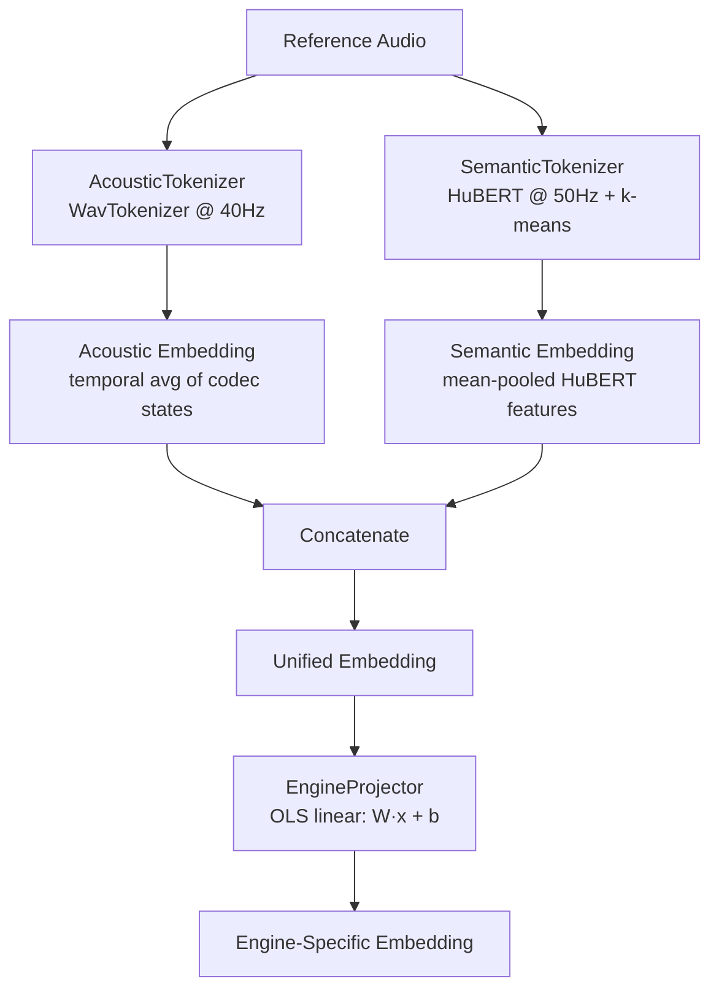
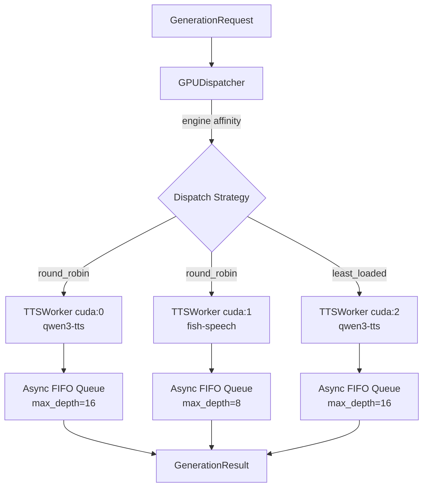

# VoxID — Voice Identity Management Platform

## System Design Document

**Version:** 0.2.0
**Status:** Beta
**Author:** Tom

---

## 1. Introduction

VoxID is a Voice Identity Management Platform that sits between identity management and TTS engines. It introduces the concept of a **voice identity**: a persistent, multi-style representation of a person or brand's voice that can be managed, versioned, and intelligently dispatched.

Voice cloning tools treat voice samples as atomic inputs — you pick one sample, generate one output. There is no abstraction for persistent identity, no style-aware routing, and no agentic selection. Given a block of text, no existing tool automatically determines which voice register is appropriate and selects accordingly. VoxID fills this gap as a thin, opinionated layer between voice identity management and TTS engines.

This document covers the system architecture, core data model, style routing algorithms, engine adapter protocol, streaming design, video skill integration, and security architecture.

---

## 2. Architecture Overview

VoxID is organized into five layers: Consumer, Contract, Core, Storage, and Adapter.



---

## 3. Core Concepts

### 3.1 Identity

An identity is a named entity — person, brand, or character — that owns one or more voice styles. It is the top-level unit; all styles, prompts, and consent records hang off it.

| Field            | Type              | Description                                                                   |
| ---------------- | ----------------- | ----------------------------------------------------------------------------- |
| `id`             | slug string       | Unique identifier, e.g. `tom`, `acme-brand`                                   |
| `name`           | string            | Display name                                                                  |
| `description`    | string \| null    | Characterization hint, e.g. "AI engineering leader, mid-30s, Indian-American" |
| `default_style`  | slug string       | Fallback style when no routing decision can be made                           |
| `created_at`     | ISO-8601 datetime | Creation timestamp                                                            |
| `metadata`       | dict              | Extensible: brand guidelines, locale, contact                                 |
| `consent_record` | ConsentRecord     | Mandatory. See §9.3                                                           |

The `consent_record` field is not optional. Every identity must carry a structured consent record addressing the ELVIS Act (US) and EU AI Act Article 52 disclosure requirements before any voice can be enrolled or exported.

### 3.2 Style

A style is a named voice register within an identity. The source of truth for a style is its reference audio and transcript. Engine-specific prompts are a derived cache — they are rebuilt on demand when the engine changes.

| Field            | Type          | Description                                              |
| ---------------- | ------------- | -------------------------------------------------------- |
| `id`             | slug string   | e.g. `conversational`, `technical`                       |
| `identity_id`    | slug string   | Parent identity                                          |
| `label`          | string        | Human-readable: "Conversational"                         |
| `description`    | string        | Routing hint used by the style classifier                |
| `default_engine` | string        | Default engine slug: `qwen3-tts`, `fish-speech`, etc.    |
| `ref_audio_path` | path          | Original WAV/FLAC reference clip — **source of truth**   |
| `ref_text`       | string        | Verbatim transcript of `ref_audio` — **source of truth** |
| `language`       | BCP-47 string | e.g. `en-US`, `zh-CN`                                    |
| `metadata`       | dict          | `energy_level`, `pitch_range`, `use_cases`               |

**Prompt-as-cache model:** Engine-specific prompts are stored under `prompts/{engine_slug}.safetensors` within the style directory. They are derived from `ref_audio` + `ref_text` via the adapter's `build_prompt` method and rebuilt lazily on first generation for a given engine, or eagerly via `voxid style rebuild`. This means switching a style to a new engine requires no re-enrollment — only a cache rebuild.

### 3.3 Base Style Taxonomy

VoxID ships four built-in base styles. Custom styles are additive and follow the same schema.

| Style            | Label          | Typical Use Cases                         | Register                          |
| ---------------- | -------------- | ----------------------------------------- | --------------------------------- |
| `conversational` | Conversational | Podcasts, casual explainers, dialogue     | Warm, relaxed, natural pacing     |
| `technical`      | Technical      | API docs, code walkthroughs, tutorials    | Precise, measured, neutral affect |
| `narration`      | Narration      | Audiobooks, long-form essays, documentary | Elevated, paced, expressive       |
| `emphatic`       | Emphatic       | Marketing, call-to-action, announcement   | High energy, assertive, punchy    |

Custom styles are registered identically to base styles. The router uses the `description` field as a semantic anchor for classification, so custom style descriptions should be written with routing in mind.

### 3.4 Voice Prompt Store

All identity data is stored under `~/.voxid/`. The layout is:

```text
~/.voxid/
├── config.toml
├── identities/
│   └── {identity_slug}/
│       ├── identity.toml
│       ├── consent.json
│       └── styles/
│           └── {style_slug}/
│               ├── style.toml
│               ├── ref_audio.wav              # source of truth
│               ├── ref_text.txt               # source of truth
│               ├── embedding.safetensors      # versioned speaker embedding
│               └── prompts/                   # derived cache, keyed by engine
│                   ├── qwen3-tts.safetensors
│                   ├── fish-speech.safetensors # built on demand
│                   └── cosyvoice2.safetensors  # built on demand
├── cache/
│   └── router/
│       └── decisions.db
└── watermarks/
    └── {identity_slug}.seal
```

**Prompt-as-cache principle:** The `prompts/` subdirectory is a derived cache. Deleting any `.safetensors` file within it triggers re-extraction from `ref_audio.wav` on the next generation. Switching an identity from one engine to another is a cache rebuild operation (`voxid style rebuild --engine <slug>`), not a re-enrollment. The `ref_audio.wav` + `ref_text.txt` pair is the only artifact required to reproduce a style on any engine.

**Why SafeTensors over pickle:** CVE-2025-1716 and JFrog's 2025 zero-day research demonstrated that pickle deserialization is an arbitrary code execution vector. Any `.pkl` file received from an untrusted source — or even a corrupted trusted source — executes Python at load time. SafeTensors is a 400-line Rust implementation with no code execution path. Reads are zero-copy memory-mapped. The format is trivially auditable.

**Embedding versioning:** Each `embedding.safetensors` file stores `model_id` and `timestamp` in its metadata header. On re-enrollment, a new versioned file is written. VoxID retains the last three versions per style. No version is deleted on re-enroll; deletion requires explicit CLI invocation.

**Watermark store:** `watermarks/{identity_slug}.seal` contains the AudioSeal payload (profile UUID + enrollment timestamp) used for identity verification on import. See §9.2.

---

## 4. Style Router

The style router is VoxID's core differentiator. It determines which voice register is appropriate for a given text input and returns a style decision with confidence score.

### 4.1 Unified Fast Router

The original two-tier architecture (regex + LLM) is replaced by a unified fast classifier:

**Primary: FastFit encoder classifier** (IBM Research, NAACL 2024)

FastFit uses batch contrastive learning with token-level similarity scoring. It requires 16–32 labeled examples per class and runs at approximately 1ms per inference. This replaces both the former Tier 1 regex layer and the former Tier 2 Qwen2.5-0.5B LLM fallback. With a confidence threshold of 0.8, FastFit covers over 95% of routing decisions.

**Fallback: Hierarchical Emotion Predictor** (arxiv:2405.09171)

A BERT-based model producing continuous emotion embeddings, mapped to the nearest style centroid. Invoked only when FastFit confidence falls below 0.8. Latency: 15–30ms.

**Cache:** SQLite LRU keyed on text hash. Decisions survive process restarts.

**Override:** An explicit `style=` parameter always bypasses the router entirely.



### 4.2 Segment Router (Batch Mode)

For long-form text, the segment router applies per-segment classification with prosodic boundary detection and a smoothing pass.

**Prosodic Boundary Detection**

Paragraph splits are replaced by linguistically motivated boundary detection:

| Mode         | Method                                                | Accuracy   | Latency            |
| ------------ | ----------------------------------------------------- | ---------- | ------------------ |
| Standard     | LightGBM boundary detector (POS + syntactic features) | F1 = 87%   | < 1ms per boundary |
| High-quality | PSST intonation-unit detector (CoNLL 2023)            | F1 = 95.8% | ~10ms              |

Prosodic boundary tokens (arxiv:2603.06444) are inserted before TTS dispatch, delegating pause and breath handling to the engine rather than the stitching layer.

**Smoothing Pass**

After per-segment classification, a convex interpolation pass prevents jarring style transitions:

`style_t = α × style_{t-1} + (1-α) × style_current` where α = 0.7

This operates in embedding space rather than on discrete style labels. Segment-aware conditioning (arxiv:2601.03170) applies causal masking for smooth transitions without additional training.



### 4.3 Speculative Style Routing (Streaming)

For real-time use cases, VoxID implements speculative routing. Research (PredGen, arxiv:2506.15556) confirms this approach is feasible.

The algorithm:

1. Begin generation immediately using `default_style`
2. FastFit classification completes in < 1ms — always before the first audio chunk is emitted
3. If FastFit disagrees with `default_style`, swap the voice prompt before the first chunk is released
4. For streaming: buffer the first chunk (30–100ms depending on engine) while classification runs

In practice, the speculative window is effectively zero for non-streaming cases. For streaming, the first-chunk buffer absorbs the classification latency with no perceptible delay.

---

## 5. Enrollment Pipeline

VoxID includes a scripted enrollment pipeline that guides users through recording phonetically balanced voice samples, validates quality in real-time, and registers accepted recordings as voice styles.

### 5.1 Architecture

```text
ScriptGenerator → PhonemeTracker → AudioRecorder → QualityGate → AudioPreprocessor → VoxID.add_style()
       ↑                                                                    ↓
   CMUdict + Corpus                                              SessionStore (JSON)
```

The pipeline is accessed through three surfaces:

- **Python API**: `EnrollmentPipeline` facade (create_session, record_sample, finalize)
- **CLI**: `voxid enroll` command (interactive recording + import mode)
- **REST API**: `/enroll/sessions` endpoints (session-based upload flow)

### 5.2 Phoneme Coverage

Prompt selection uses a greedy weighted set-cover algorithm (Bozkurt et al., Eurospeech 2003):

1. Load style-tagged sentences from bundled JSON corpora (310 sentences across 5 styles)
2. Score each candidate by weighted marginal gain against current coverage
3. Select the candidate with highest gain, update coverage, repeat

Phoneme weights reflect speaker-identification research:

- Nasals (/N/, /M/, /NG/): 1.5x — strongest speaker signatures
- Affricates (/CH/, /JH/): 1.5x
- Vowels: 1.2x — encode unique formant structure
- All others: 1.0x

Target: 100% coverage of 39 ARPAbet phonemes within 10 prompts per style.

### 5.3 Quality Gates

Each audio sample is validated against six gates before acceptance:

| Gate         | Threshold                  | Action          |
| ------------ | -------------------------- | --------------- |
| Duration     | 3s min, 60s max            | Hard reject     |
| SNR          | ≥25 dB reject, <40 dB warn | Reject / warn   |
| Speech ratio | ≥60% of total duration     | Hard reject     |
| RMS level    | -40 to -3 dBFS             | Hard reject     |
| Peak level   | ≤-1 dBFS                   | Clipping reject |
| Sample rate  | ≥24 kHz                    | Hard reject     |

SNR estimation uses the first 0.5s of audio as noise floor reference. Speech ratio is computed via energy-based VAD (30ms frames, -40 dB threshold), with optional Silero/WebRTC backends.

### 5.4 Audio Preprocessing

Accepted samples pass through: mono conversion → resampling to 24 kHz → RMS-based silence trimming (200ms padding) → LUFS loudness normalization (-16 LUFS via ITU-R BS.1770-4). No noise suppression — per Wildspoof 2026 findings, enhancement degrades speaker similarity.

### 5.5 Session Management

Enrollment sessions are cursor-based state machines over a 2D grid of (styles × prompts). Sessions persist as JSON for resumability after interruption. Terminal states (COMPLETE, ABANDONED) are absorbing. The `best_sample_for_style` selector picks the accepted sample with highest SNR for style registration.

### 5.6 Consent

Consent recording is the first step in enrollment. The speaker reads a personalized consent statement aloud. The audio is saved alongside the identity with a SHA-256 file hash in `consent.json` for tamper verification.

### 5.7 Re-enrollment Health

`check_enrollment_health()` assesses whether enrollment should be refreshed based on age (>3 years) and voice drift detection (cosine similarity below threshold across enrolled styles).

---

## 6. Multi-Sample Fusion (Enrollment)

When multiple enrollment clips are provided, VoxID fuses them into a unified reference. Fusion operates at the **audio level**, not the embedding level — this keeps the fusion pipeline engine-agnostic.

### 5.1 Audio-Level Fusion (Engine-Agnostic)

Fusion produces a unified reference WAV from multiple enrollment clips. Each engine then independently extracts its own prompt from this unified WAV via `build_prompt`. This means fusion results transfer across engines without re-running the fusion pipeline.

The fusion pipeline:

1. **Clip selection:** Use sentence-similarity scoring (MRMI-TTS approach) to select the most representative subset of clips. Exclude clips whose WavLM-ECAPA embedding falls below the inter-clip similarity threshold.
2. **H/ASP segment construction:** Split selected clips into 2.67-second segments. Concatenate with silence-padded boundaries. This approach outperforms naive full-clip concatenation by 15% on subjective speaker similarity (arxiv:2506.20190).
3. **Output:** A unified `fused_ref_audio.wav` stored alongside per-style `ref_audio.wav` files. Each engine's `build_prompt` extracts from this fused WAV independently.

### 5.2 Embedding-Level Enhancement (Engine-Specific, Optional)

For engines that expose their embedding space, optional post-extraction enhancements can be applied:

- **Attention back-end fusion:** Scaled-dot self-attention over N per-segment embeddings → single fused vector. Available when 3+ clips are enrolled. Open-source: `nii-yamagishilab/Attention_Backend_for_ASV`.
- **SEED denoising:** Diffusion model cleans noisy or reverberant embeddings before fusion. 19.6% improvement on environment-mismatch (Interspeech 2025). Invoked when signal quality score falls below threshold.

These enhancements are adapter-specific optimizations — they improve quality for a given engine but are not required for the system to function. The audio-level fusion in §5.1 is always sufficient.

### 5.4 Quality Metrics

| Metric                           | Purpose                                        | Benchmark                    |
| -------------------------------- | ---------------------------------------------- | ---------------------------- |
| WavLM-ECAPA (VoxSim fine-tuned)  | Primary speaker similarity                     | LCC 0.835 vs. human judgment |
| U3D rhythm metric                | Catches timbre-correct / rhythm-wrong failures | —                            |
| Uncertainty-aware cosine scoring | Fusion confidence signal                       | —                            |

WavLM-ECAPA replaces resemblyzer across all similarity scoring paths.

### 5.5 Spike Test Protocol

Before committing to a fusion strategy, a structured experiment matrix is run:

| Experiment | Clips                | Method                | Metric     | Pass Threshold |
| ---------- | -------------------- | --------------------- | ---------- | -------------- |
| Baseline   | 1 clip               | Single x-vector       | VoxSim LCC | > 0.70         |
| H/ASP      | 3–5 clips            | Segment-averaging     | VoxSim LCC | > 0.80         |
| Attention  | 5+ clips             | Self-attention fusion | VoxSim LCC | > 0.83         |
| Noisy      | 3 clips (SNR < 15dB) | SEED + H/ASP          | VoxSim LCC | > 0.75         |

Decision matrix: if Attention fusion does not exceed H/ASP by more than 2% LCC on clean clips, deploy H/ASP as default. Attention fusion is reserved for enrollments with 5+ clips.

---

## 7. Engine Adapter Layer

### 6.1 Adapter Protocol

Each engine is wrapped by an adapter implementing a four-method protocol plus a capability declaration. No adapter may reach outside its defined interface.

**Core Methods:**

| Method               | Inputs                            | Output              | Description                               |
| -------------------- | --------------------------------- | ------------------- | ----------------------------------------- |
| `engine_name`        | —                                 | string              | Canonical engine slug                     |
| `build_prompt`       | ref_audio, ref_text               | SafeTensors path    | Precompute and cache the voice prompt     |
| `generate`           | text, prompt_path, style_metadata | WAV bytes           | Single-shot generation                    |
| `generate_streaming` | text, prompt_path, style_metadata | byte chunk iterator | Streaming generation, first chunk ≤ 200ms |

**Capability Flags:**

Each adapter declares its capabilities via a `capabilities` property. The dispatcher uses these flags for intelligent routing — selecting the best available engine for a given request when no explicit engine is specified.

| Flag                           | Type      | Description                                              | Example                    |
| ------------------------------ | --------- | -------------------------------------------------------- | -------------------------- |
| `supports_streaming`           | bool      | Whether `generate_streaming` is implemented              | True                       |
| `supports_emotion_control`     | bool      | Whether the engine supports independent emotion vectors  | True (IndexTTS-2)          |
| `supports_paralinguistic_tags` | bool      | Whether `[laugh]`, `[cough]` etc. are supported in text  | True (Chatterbox)          |
| `max_ref_audio_seconds`        | float     | Maximum reference audio duration the engine accepts      | 30.0                       |
| `supported_languages`          | list[str] | BCP-47 language codes the engine handles                 | `["en", "zh", "ja"]`       |
| `streaming_latency_ms`         | int       | Expected first-chunk latency in streaming mode           | 150                        |
| `supports_word_timing`         | bool      | Whether the engine can emit word-level timestamps inline | False (use forced aligner) |

The dispatcher can use these flags for automatic engine selection: e.g., when a style specifies `language=ko` and the default engine doesn't support Korean, the dispatcher falls back to an engine whose `supported_languages` includes `ko`.

Adapters are responsible for loading their own model weights. The dispatcher holds no model state.

### 6.2 Supported Engines

| Engine             | Stars | Zero-Shot | Streaming      | Emotion Control     | Languages | License        | Priority |
| ------------------ | ----- | --------- | -------------- | ------------------- | --------- | -------------- | -------- |
| Qwen3-TTS          | —     | ✓         | ✓              | Via text prompt     | 10+       | Apache-2.0     | Phase 0  |
| Fish Speech S2 Pro | 28.6k | ✓         | ✓              | ✗                   | 80+       | Apache-2.0     | Phase 6  |
| CosyVoice2         | 20.2k | ✓         | ✓ (150ms TTFB) | ✗                   | 9+        | Apache-2.0     | Phase 6  |
| IndexTTS-2         | 19.5k | ✓         | ✓              | ✓ (disentangled)    | 2         | Apache-2.0     | Phase 6  |
| Chatterbox Turbo   | 11k+  | ✓         | ✓ (< 200ms)    | Paralinguistic tags | 23        | MIT            | Phase 6  |
| F5-TTS             | 14.2k | ✓         | ✓              | ✗                   | Multi     | MIT / CC-BY-NC | Phase 6  |

Phase 0 engines ship with the initial release. Phase 6 engines are released as optional adapter packages.

### 6.3 Audio Stitching

| Path                         | Library              | Rationale                                       |
| ---------------------------- | -------------------- | ----------------------------------------------- |
| Standard stitching           | pydub                | Purpose-built for audio editing, ergonomic API  |
| Batch / performance-critical | Pedalboard (Spotify) | C++ core, significantly faster on large batches |

librosa is not used in the stitching path — it is a signal analysis library, not an editing library.

Pause durations between segments are informed by ProsodyFM predictions rather than a fixed 50ms crossfade. ProsodyFM outputs prosody-aware pause durations that respect the detected boundary type (clause, sentence, paragraph).

---

## 8. Streaming Architecture

### 7.1 Streaming Generation

VoxID's streaming path targets the following latency benchmarks:

| Reference              | First-Packet Latency | Environment  |
| ---------------------- | -------------------- | ------------ |
| VoXtream (open-source) | 102ms                | Server       |
| SpeakStream            | 30ms                 | M4 Pro local |
| CosyVoice2             | 150ms                | Server       |
| Chatterbox Turbo       | < 200ms              | Server       |

The `generate_streaming` adapter method yields byte chunks. The dispatcher assembles a Server-Sent Events stream for REST consumers or yields raw chunks for Python library consumers.

Speculative routing (§4.3) ensures style classification completes before the first chunk is released.

### 7.2 Word-Level Timing

For subtitle synchronization in video skills, VoxID produces word-level timing data alongside audio. Three methods are supported, ranked by accuracy:

| Rank | Tool                         | Method                    | Strength                                       |
| ---- | ---------------------------- | ------------------------- | ---------------------------------------------- |
| 1    | NeMo Forced Aligner (NVIDIA) | CTC-based alignment       | Highest accuracy on technical vocabulary       |
| 2    | ForceAlign                   | Pure Python               | Simplest integration, zero system dependencies |
| 3    | WhisperX                     | wav2vec2 forced alignment | Good general-purpose accuracy                  |

Word timings are stored as a list of `(word, start_ms, end_ms)` tuples in the `GeneratedScene` output. Video skills consume this directly for subtitle track generation.

---

## 9. Video Skill Integration

### 8.1 SceneManifest Schema

`SceneManifest` is the shared contract between all video skills and VoxID. It is defined once as a Pydantic schema and imported by both sides.

**SceneNarration** — a single narration unit:

| Field           | Type                  | Description                                    |
| --------------- | --------------------- | ---------------------------------------------- |
| `scene_id`      | string                | Unique identifier within the manifest          |
| `text`          | string                | Text to synthesize                             |
| `style`         | string \| null        | Explicit style override; null triggers routing |
| `duration_hint` | float \| null         | Target duration in seconds; advisory only      |
| `language`      | BCP-47 string \| null | Overrides identity default if set              |

**SceneManifest** — collection of narrations:

| Field         | Type                 | Description                              |
| ------------- | -------------------- | ---------------------------------------- |
| `identity_id` | string               | Target identity slug                     |
| `engine`      | string \| null       | Engine override; null uses style default |
| `scenes`      | list[SceneNarration] | Ordered list of narration units          |
| `metadata`    | dict                 | Pass-through for skill-specific data     |

**GeneratedScene** — output per scene:

| Field          | Type                       | Description                                 |
| -------------- | -------------------------- | ------------------------------------------- |
| `scene_id`     | string                     | Matches input scene_id                      |
| `audio_path`   | path                       | Generated WAV file                          |
| `duration_ms`  | int                        | Actual audio duration                       |
| `word_timings` | list[tuple[str, int, int]] | Word-level timing: (word, start_ms, end_ms) |
| `style_used`   | string                     | Resolved style slug                         |
| `engine_used`  | string                     | Resolved engine slug                        |

**GenerationResult** — full output:

| Field               | Type                 | Description                  |
| ------------------- | -------------------- | ---------------------------- |
| `manifest_id`       | string               | Echo of manifest metadata id |
| `scenes`            | list[GeneratedScene] | Ordered results              |
| `total_duration_ms` | int                  | Sum of scene durations       |

### 8.2 Integration Workflow



### 8.3 Manim Integration

VoxID uses an audio-first workflow with Manim:

1. VoxID generates all audio via `SceneManifest`
2. Scene timing is derived from actual audio `duration_ms`, not estimates
3. Manim scenes are constructed with timing anchored to audio boundaries
4. Audio and video are composited with ffmpeg

The integration point is the `manim-voiceover` plugin. VoxID registers itself as a custom `SpeechService` within manim-voiceover's service registry, making it available as a drop-in replacement for other TTS providers.

### 8.4 Remotion Integration

Remotion's frame-accurate model maps directly to VoxID's output:

- Each `<Sequence>` component receives a VoxID-generated audio file
- `durationInFrames` is computed from `duration_ms` and the composition frame rate
- Word-level subtitle tracks are generated from `word_timings` and rendered as `<Subtitle>` sequences
- No estimated durations — all timing derives from actual generated audio

### 8.5 SceneManifest Conventions

| Convention      | Rule                                                           |
| --------------- | -------------------------------------------------------------- |
| `scene_id`      | Must be unique within manifest; use kebab-case                 |
| `text`          | Plain text only; no SSML in the manifest layer                 |
| `style`         | Set to null to enable routing; set explicitly to bypass router |
| `duration_hint` | Advisory only; never used to truncate or pad audio             |
| `language`      | Omit unless scene language differs from identity default       |

---

## 10. Security Architecture

### 9.1 Serialization Security

All voice embeddings and precomputed prompts are stored as SafeTensors. The prohibition is absolute: no `.pkl` files are created, read, or accepted in any code path. Imported `.voxid` archives containing pickle-serialized data are rejected at the manifest verification step, before any deserialization occurs.

HMAC-SHA256 signatures are computed over all archive manifest entries at export time. Signatures are verified before any file in an imported archive is read.

### 9.2 Audio Watermarking

VoxID embeds an AudioSeal watermark (Meta, MIT license, 2024) into every generated audio file. AudioSeal operates at sample level and is 1000× faster than WavMark at comparable robustness.

The watermark payload encodes: profile UUID + enrollment timestamp. The payload is stored in `watermarks/{identity_slug}.seal`. On archive import, the watermark is verified against the seal before the identity is registered.

### 9.3 Consent Framework

Every identity carries a `consent.json` at `identities/{slug}/consent.json`. The consent record schema:

| Field           | Type     | Description                                           |
| --------------- | -------- | ----------------------------------------------------- |
| `timestamp`     | ISO-8601 | When consent was recorded                             |
| `scope`         | enum     | `personal` or `commercial`                            |
| `jurisdiction`  | string   | e.g. `US`, `EU`, `UK`                                 |
| `transferable`  | bool     | Whether the identity may be exported to third parties |
| `document_hash` | SHA-256  | Hash of the consent document presented at enrollment  |

Consent is re-verified on export. A non-transferable identity cannot be exported. An identity with expired jurisdiction-specific consent (determined by `jurisdiction` rules) emits a warning and requires re-acknowledgment before export.

### 9.4 Voice Drift Detection

ECAPA-TDNN embeddings are compared against the enrollment baseline using rolling cosine similarity. A drift score below 0.75 triggers a soft flag recommending re-enrollment. The system never hard-rejects generation based on drift. Re-enrollment replaces only the embedding; prior versions are retained per §3.4.

### 9.5 Embedding Versioning

Versioning policy:

- Each embedding file stores `model_id` and `timestamp` in the SafeTensors metadata header
- On re-enrollment, a new file is written with an incremented version suffix
- The last three versions are retained per style
- Deletion requires explicit `voxid style purge-versions` invocation
- The active version is recorded in `style.toml` as `embedding_version`

---

## 11. Public API Surface

### 10.1 Python Library

VoxID is imported as `from voxid import VoxID`. The primary interface:

| Method                   | Signature Summary                                                              | Description                                       |
| ------------------------ | ------------------------------------------------------------------------------ | ------------------------------------------------- |
| `VoxID()`                | `VoxID(store_path=None)`                                                       | Initialize, defaulting to `~/.voxid/`             |
| `create_identity`        | `(id, name, description, default_style, metadata)`                             | Register a new identity                           |
| `add_style`              | `(identity_id, id, label, description, engine, ref_audio, ref_text, language)` | Enroll a style from reference audio               |
| `generate`               | `(identity_id, text, style=None, engine=None)`                                 | Single-shot generation; returns audio path        |
| `generate_segments`      | `(identity_id, texts, styles=None)`                                            | Batch generation with smoothing                   |
| `route`                  | `(identity_id, text)`                                                          | Return style decision without generating          |
| `generate_from_manifest` | `(manifest)`                                                                   | Full manifest execution; returns GenerationResult |
| `plan_from_manifest`     | `(manifest)`                                                                   | Return generation plan without executing          |
| `export_identity`        | `(identity_id, output_path)`                                                   | Export to signed `.voxid` archive                 |
| `import_identity`        | `(archive_path)`                                                               | Import, verify, and register identity             |

### 10.2 REST API

The REST API is served by FastAPI on a configurable port (default: 8765).

| Method | Endpoint                             | Description                |
| ------ | ------------------------------------ | -------------------------- |
| POST   | `/api/identities`                    | Create identity            |
| GET    | `/api/identities`                    | List identities            |
| GET    | `/api/identities/{id}`               | Get identity               |
| DELETE | `/api/identities/{id}`               | Delete identity            |
| POST   | `/api/identities/{id}/styles`        | Add style                  |
| GET    | `/api/identities/{id}/styles`        | List styles                |
| POST   | `/api/generate`                      | Single-shot generation     |
| POST   | `/api/generate/segments`             | Segment generation         |
| POST   | `/api/generate/manifest`             | Manifest-driven generation |
| POST   | `/api/generate/stream`               | Streaming generation (SSE) |
| POST   | `/api/route`                         | Route without generating   |
| GET    | `/api/health`                        | Health check               |
| POST   | `/api/enroll/sessions`               | Create enrollment session  |
| GET    | `/api/enroll/sessions/{id}`          | Get session status         |
| POST   | `/api/enroll/sessions/{id}/samples`  | Upload audio sample        |
| POST   | `/api/enroll/sessions/{id}/complete` | Finalize enrollment        |
| GET    | `/api/v1/serving/health`             | Multi-GPU dispatch status  |

All endpoints return JSON. `/generate/stream` returns `text/event-stream` with audio chunks base64-encoded in event data fields.

### 10.3 CLI

The CLI is built on Click and available as the `voxid` command.

| Command                                         | Description                         |
| ----------------------------------------------- | ----------------------------------- |
| `voxid identity create`                         | Create a new identity               |
| `voxid identity list`                           | List all identities                 |
| `voxid identity show <id>`                      | Show identity details               |
| `voxid identity delete <id>`                    | Delete identity                     |
| `voxid style add <identity>`                    | Add a style via interactive prompts |
| `voxid style list <identity>`                   | List styles for an identity         |
| `voxid style purge-versions <identity> <style>` | Remove old embedding versions       |
| `voxid generate <identity> <text>`              | Generate audio, print output path   |
| `voxid generate --style <style>`                | Generate with explicit style        |
| `voxid generate --manifest <file>`              | Generate from SceneManifest JSON    |
| `voxid route <identity> <text>`                 | Show routing decision               |
| `voxid export <identity> <output>`              | Export signed archive               |
| `voxid import <archive>`                        | Import and verify archive           |
| `voxid serve`                                   | Start REST API server               |

---

## 12. Technical Decisions

| Decision             | Choice                          | Rationale                                                                             |
| -------------------- | ------------------------------- | ------------------------------------------------------------------------------------- |
| Storage format       | TOML + SafeTensors + WAV        | Human-readable config, secure binary embeddings (no RCE), lossless audio              |
| Router primary       | FastFit encoder classifier      | ~1ms inference, no model load at request time, covers > 95% of routing decisions      |
| Router fallback      | Hierarchical Emotion Predictor  | ~15ms BERT-based, continuous emotion embeddings, invoked only on low-confidence cases |
| Router cache         | SQLite LRU                      | Single-file, zero-config, survives restarts, no server dependency                     |
| Prompt serialization | SafeTensors                     | No code execution path, zero-copy reads, 400-line auditable Rust implementation       |
| Audio stitching      | pydub + Pedalboard              | pydub for ergonomic editing, Pedalboard (C++ core) for batch performance              |
| Text segmentation    | LightGBM prosodic boundary      | < 1ms, F1 = 87%, linguistically motivated rather than paragraph-split heuristics      |
| Smoothing            | StyleTTS 2 convex interpolation | Operates in embedding space, α = 0.7, prevents discrete label-switch artifacts        |
| Speaker similarity   | WavLM-ECAPA (VoxSim fine-tuned) | LCC 0.835 vs. human judgment; replaces resemblyzer                                    |
| Watermarking         | AudioSeal (Meta, MIT)           | 1000× faster than WavMark, sample-level granularity, MIT license                      |
| Fusion strategy      | H/ASP segment-averaging         | 15% better than single-clip x-vector on subjective similarity                         |
| Word timing          | NeMo Forced Aligner             | CTC-based, highest accuracy on technical vocabulary                                   |
| Config format        | TOML                            | Human-editable, stdlib support in Python 3.11+                                        |
| API framework        | FastAPI                         | Async-native, auto OpenAPI, matches VoiceBox                                          |
| CLI framework        | Click                           | Minimal, composable, no global state                                                  |
| Video contract       | SceneManifest (Pydantic)        | Single schema for all video integrations; validates at boundary                       |

---

## 13. Dependency Graph



Engine adapter packages are optional dependencies installed per engine: `pip install voxid[fish-speech]`, `pip install voxid[cosyvoice2]`, etc. The core package ships with the Qwen3-TTS adapter only.

---

## 14. Three-Tier Semantic Routing

The original two-tier router (FastFit + hierarchical emotion predictor) has been refined into a three-tier cascade:

| Tier | Classifier              | Latency | Confidence Threshold | Description                                              |
| ---- | ----------------------- | ------- | -------------------- | -------------------------------------------------------- |
| 1    | RuleBasedClassifier     | ~0ms    | ≥ 0.9                | Deterministic keyword/pattern heuristics                 |
| 1.5  | SemanticStyleClassifier | ~10ms   | ≥ 0.8                | MLP with character n-grams (2-4) + word n-grams (1-2)    |
| 2    | CentroidClassifier      | ~15ms   | Always returns       | TF-IDF bag-of-words cosine similarity to style centroids |

The SemanticStyleClassifier uses a hashed feature vector (4096 features) fed through a 2-layer MLP (`input → ReLU(128) → softmax(n_classes)`) with Platt scaling for calibrated confidence. It supports contextual blending: 80% target segment weight + 20% weighted average of neighboring segments (decay factor 0.5).

Training: `classifier.fit(texts, labels)` with n-gram feature extraction. Persistence via SafeTensors.

---

## 15. Unified Tokenizer Architecture

The tokenizer creates engine-agnostic speaker representations by combining two complementary tokenization streams:



**AcousticTokenizer:** WavTokenizer (`novateur/WavTokenizer-medium-speech-75token`) extracts multi-codebook discrete tokens and derives a speaker embedding via temporal averaging of codec hidden states.

**SemanticTokenizer:** HuBERT (`facebook/hubert-base-ls960`) layer 6 features quantized to 500 k-means clusters. Raw features retained for downstream alignment.

**EngineProjector:** Ordinary least squares linear projection fitted on paired `(unified, engine)` embeddings. Formula: `engine_embedding = unified_embedding @ W + b`. Weights persisted as SafeTensors.

---

## 16. Context-Aware Generation

The context system provides prosodic continuity across long documents by tracking a rolling window of segment histories and generating conditioning signals.

### Context Manager

A FIFO buffer (default window_size=5) of `SegmentHistory` entries, each containing: text, style, duration_ms, final F0 (Hz), final energy (RMS), speaking rate (words/sec).

Document position is computed as `segment_index / total_segments` for a [0, 1] range.

### Context Conditioner

Translates `GenerationContext` into three independent conditioning strategies:

| Strategy        | Output                      | Purpose                                           |
| --------------- | --------------------------- | ------------------------------------------------- |
| Text-level      | SSML `<prosody>` tags       | Engine-interpretable prosody hints (rate, pitch)  |
| Parameter-level | `{speed, pitch_hz, energy}` | Numeric continuity params passed to adapter       |
| Stitch-level    | `{pause_ms, crossfade_ms}`  | Context-derived pause durations for AudioStitcher |

Strength parameter (0.0–1.0) acts as a master dial. Each strategy can be independently enabled/disabled.

---

## 17. Synthesis Detection

Anti-spoofing ensemble for detecting AI-generated audio.

### Ensemble Architecture

Three complementary models with weighted voting:

| Model   | Weight | Input           | Architecture              | Detection Strength                      |
| ------- | ------ | --------------- | ------------------------- | --------------------------------------- |
| AASIST  | 0.40   | Mel spectrogram | Graph attention + pooling | Spectral artifact detection             |
| RawNet2 | 0.35   | Raw waveform    | Sinc filters + GRU        | Waveform-level anomaly detection        |
| LCNN    | 0.25   | LFCC features   | Light CNN                 | Frequency cepstral coefficient analysis |

### Decision Logic

1. Each model produces a spoofing probability [0, 1]
2. Weighted ensemble score = Σ(weight_i × score_i)
3. Model agreement = fraction of models agreeing on label
4. Classification: score ≥ 0.7 → SYNTHETIC, score ≤ 0.4 → GENUINE, else UNCERTAIN
5. Minimum agreement threshold: 0.5

### Diffusion Artifact Analysis

Separate analyzer detecting diffusion-model-specific synthesis patterns:

- **Spectral smoothness:** Ratio of high-frequency energy (unnatural smoothness in diffusion outputs)
- **Temporal discontinuity:** Spectral flux spikes at chunk boundaries
- **Harmonic regularity:** Detection of unnaturally perfect harmonic structure

---

## 18. Multi-GPU Serving Architecture

Async GPU dispatcher for high-throughput TTS serving.



### Worker Lifecycle

Workers transition through: `STARTING → READY → UNHEALTHY → STOPPED`. Health checks run at `health_check_interval_s` (default 30s). Workers track queue_depth, total_processed, total_errors, and gpu_memory_bytes.

### Backpressure

Each worker has a bounded async queue (`max_queue_depth`). When full, `submit()` raises `QueueFullError` immediately rather than blocking — the dispatcher selects the next available worker.

### vLLM Integration

The `plugin.py` module exposes `register_voxid_plugin()` for vLLM's plugin discovery mechanism. The serving config is loaded from TOML and registered as a global singleton accessible via `get_registered_config()`.

---

## 19. References

### Embedding Fusion

- H/ASP Segment-Averaging: arxiv:2506.20190
- Attention Back-end for ASV: github.com/nii-yamagishilab/Attention_Backend_for_ASV
- SEED Denoising (Interspeech 2025): speaker embedding denoising via diffusion

### Style Classification

- FastFit (IBM, NAACL 2024): github.com/IBM/fastfit — token-level similarity batch contrastive training
- Hierarchical Emotion Predictor: arxiv:2405.09171
- SetFit (HuggingFace): github.com/huggingface/setfit — few-shot contrastive fine-tuning

### Streaming TTS

- VoXtream (102ms first-packet, open-source): streaming TTS architecture reference
- SpeakStream (30ms on M4 Pro): local streaming TTS latency reference
- PredGen speculative generation: arxiv:2506.15556

### Security

- AudioSeal (Meta, MIT 2024): github.com/facebookresearch/audioseal — neural audio watermarking
- SafeTensors: github.com/huggingface/safetensors — CVE-2025-1716, JFrog 2025 zero-days rationale
- ELVIS Act (US): protecting recording artists from unauthorized voice synthesis
- EU AI Act Article 52: disclosure requirements for AI-generated synthetic voice

### Prosody

- ProsodyFM: prosody-informed adaptive pause durations for TTS stitching
- PSST intonation-unit detector (CoNLL 2023): F1 = 95.8% prosodic boundary detection
- LightGBM boundary detector (EMNLP 2025): F1 = 87%, < 1ms per boundary
- Prosodic boundary tokens: arxiv:2603.06444
- Segment-aware conditioning: arxiv:2601.03170

### Evaluation

- VoxSim (VoxSRC 2023): WavLM-ECAPA fine-tuned on subjective similarity, LCC 0.835
- U3D rhythm metric: catches timbre-correct / rhythm-wrong generation failures
- Uncertainty-aware cosine scoring: fusion confidence calibration

### Key Repositories

| Repository                                   | Description                                 |
| -------------------------------------------- | ------------------------------------------- |
| `IBM/fastfit`                                | FastFit few-shot classifier                 |
| `huggingface/safetensors`                    | SafeTensors serialization format            |
| `facebookresearch/audioseal`                 | Neural audio watermarking                   |
| `NVIDIA/NeMo`                                | NeMo Forced Aligner (CTC-based word timing) |
| `nii-yamagishilab/Attention_Backend_for_ASV` | Attention-based speaker embedding fusion    |
| `huggingface/setfit`                         | SetFit contrastive few-shot classification  |
| `jiawei-yang/voxtream`                       | VoXtream streaming TTS reference            |
| `manim-community/manim-voiceover`            | Manim TTS integration plugin                |
